# Artificial Potential Field Path Planning with Virtual Obstacles

Path planning for a differential-drive mobile robot using the Artificial Potential Field
(APF) method, extended with virtual obstacles to escape local minima.

Implemented in two environments: a **Webots** simulation written in C, and a **MATLAB**
controller running on a physical **e-puck** robot over a serial link.

**Higher Institute for Applied Sciences and Technology (HIAST), Damascus**
Department of Electromechanical Systems, Mobile Robotics course project, 2021/2022

**Team:** Ahmad Mustafa · Ashraf Faraj · Ahmad Al-Issa
**Supervisors:** Dr. Shadi Al-Bitar · Eng. Tarek Saati

---

## Objective

Move a mobile robot from a start position to a goal while avoiding a triangular
obstacle, and extend the classical APF algorithm so the robot can escape the local
minima (potential wells) that the method is subject to.

Requirements:

1. Implement the modified APF algorithm in MATLAB and test it on the physical e-puck
   by cross compilation.
2. Build a model of the map in Webots.
3. Implement and test the navigation algorithm in Webots in C.

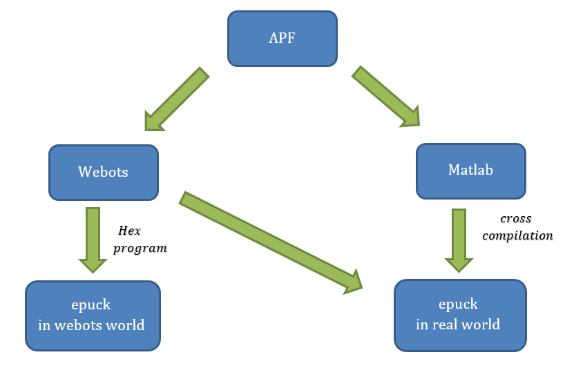

---

## Path planning background

Three families of path-planning strategy were compared before selecting one.

**Road map**: represent the free space as a graph of collision-free routes, then search
the graph.

| Visibility graph | Voronoi diagram |
|---|---|
| 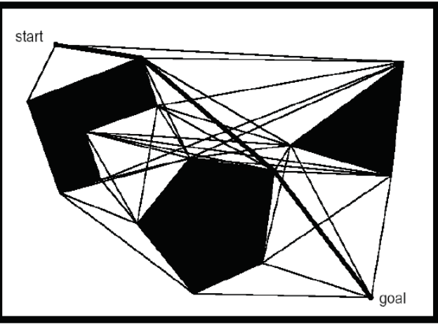 | 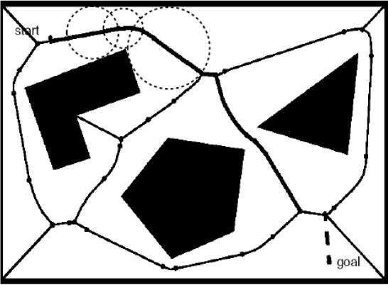 |
| Connects obstacle vertices that are mutually visible. | Builds routes that maximise clearance from the nearest obstacle. |

**Cell decomposition**: partition the space into cells, each marked occupied or free.

| Exact | Approximate |
|---|---|
| 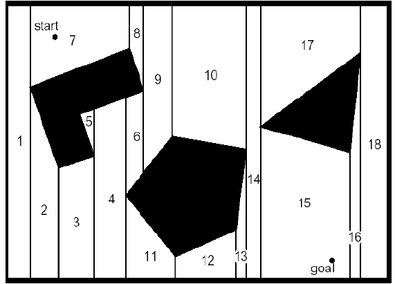 | 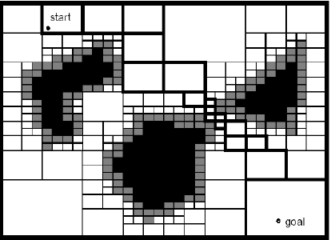 |
| Cells follow obstacle geometry. | Uniform fixed-size grid. |

**Potential field**: the method used here. The robot is treated as a particle in a force
field: the goal generates an attractive field, obstacles generate repulsive fields, and
motion follows the resultant.

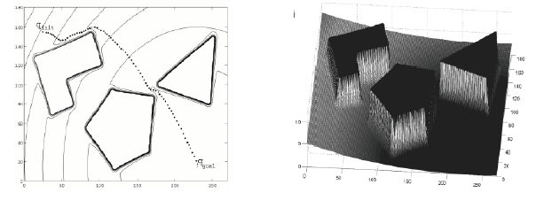

---

## Algorithm

### Attractive field

```
U_att(q) = ½ · k_att · ‖q − q_goal‖²
F_att(q) = −k_att · (q − q_goal)
```

### Repulsive field

The FIRAS function, active only within a cut-off radius `ρ₀`:

```
U_rep(q) = ½ · k_rep · (1/ρ(q) − 1/ρ₀)²     if ρ(q) ≤ ρ₀
         = 0                                 otherwise

F_rep(q) = k_rep · (1/ρ(q) − 1/ρ₀) · (1/ρ²(q)) · (q − q_obst)/ρ(q)     if ρ(q) ≤ ρ₀
         = 0                                                            otherwise
```

`ρ(q)` is the shortest distance from the robot to the obstacle and `q_obst` the nearest
point on it. Both implementations compute this against a polygon.

### Local minima

The resultant of the attractive and repulsive forces can be approximately zero at a point
that is not the goal. The robot then halts or oscillates about that position without
leaving it.

Detection uses the standard deviation of a sliding window of the last 30 robot positions.
A small spread indicates the positions are clustered in a limited region, which
corresponds to a potential well. The Webots implementation adds a second condition: the
angle between the attractive and repulsive forces must exceed 90°.

### Virtual obstacle

On detection, a new repulsive source is placed at the centroid of the position window:

```
F_ext(q) = (k_e/d_e) · (q − q_ext)                  if ‖q − q_ext‖ ≤ d_e
         = k_e · (q − q_ext)/‖q − q_ext‖            otherwise
```

The total force becomes:

```
F(q) = F_att(q) + F_rep(q) + Σᵢ F_ext,i(q)
```

The Webots implementation accumulates up to 50 virtual obstacles and scales their
combined force by `1 − exp(−d_goal²/σ)` so that the contribution vanishes near the goal.

### Motion command

```
α   = atan2(F_y, F_x) − θ
v   = k_v · ‖F‖ · cos α
ω   = k_w · α
v_l = v + ω
v_r = v − ω
```

Full derivation: [docs/algorithm.md](docs/algorithm.md).

---

## Robot

The e-puck is an open-hardware educational mobile robot developed at EPFL.

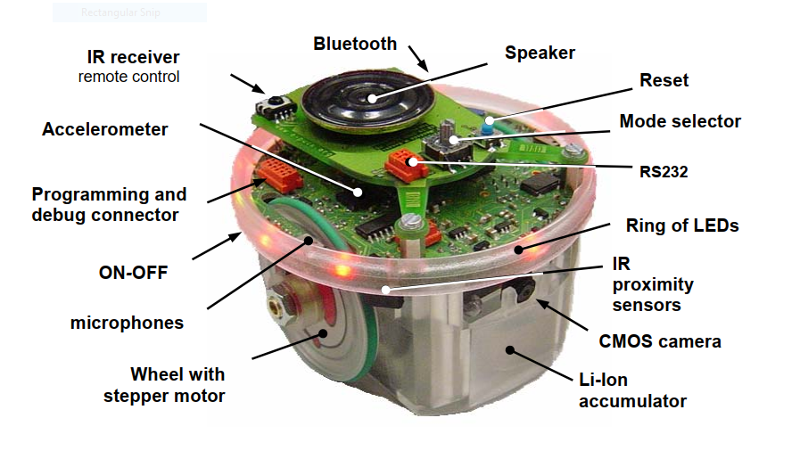

| | |
|---|---|
| Processor | dsPIC, 60 MHz |
| Drive | two stepper motors, differential |
| Wheel radius `r` | 0.0205 m |
| Axle length `l` | 0.052 m |
| Sensors used | incremental wheel encoders |
| Sensors available, unused | 8 IR proximity, 8 light, 3 ground, VGA camera, 3 microphones |
| Communication | RS-232, Bluetooth |

Position is obtained by odometry from the wheel encoders:

```
θ_new = θ_old + (r/l)·(Δs_l − Δs_r)
x_new = x_old + r·cos(θ_new)·(Δs_r + Δs_l)/2
y_new = y_old + r·sin(θ_new)·(Δs_r + Δs_l)/2
```

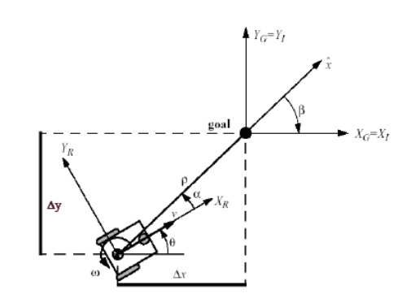

Kinematic model, control law and Lyapunov stability analysis:
[docs/robot-model.md](docs/robot-model.md).

---

## Map

The obstacle is a triangle with vertices `(22, 9)`, `(26, 25)`, `(7, 21)` cm. The robot
starts at `(4, 4)` cm and the goal is at `(36, 24.5)` cm.

| Real map | Webots model |
|---|---|
| 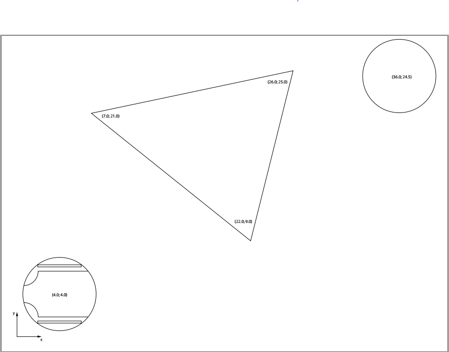 | 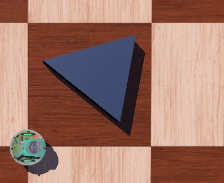 |

In the Webots world the same map is offset by 46 cm, since the 1 × 1 m floor has its
origin at a corner and the robot starts at the centre `(0.5, 0.5) m`.

---

## Repository layout

```
webots/                         Webots R2021a simulation
├── controllers/my_controller/  my_controller.c, Makefile
├── worlds/empty.wbt            map, obstacle, wall and e-puck
└── protos/Floor3.proto         floor PROTO (Cyberbotics)

matlab/test_controller2.m       controller for the physical e-puck

docs/                           algorithm, robot model, implementation notes
└── figures/                    diagrams and recorded results
```

---

## Implementation comparison

| | MATLAB (hardware) | Webots (simulation) |
|---|---|---|
| Virtual obstacles | one, replaced on each detection | up to 50, accumulated |
| Local-minimum test | window σ + distance conditions | + force angle > 90° |
| Re-trigger guard | none | 120-step counter |
| Scaling near goal | not applied | `1 − exp(−d²/σ)` |
| `k_a` | 10 | 20 |
| `k_r` | 5 000 | 1 000 000 |
| `k_v` | 6 | 6 |
| `k_w` | 2 500 | 800 |
| `ρ₀` | 6 | 8 |
| `d_e` | 2 | 0.05 |
| σ threshold | ≈ 1.167 | 0.05 |

Details: [docs/implementation.md](docs/implementation.md).

---

## Running the Webots simulation

1. Install [Webots](https://cyberbotics.com/) R2021a or later.
2. Open `webots/worlds/empty.wbt`.
3. Webots compiles the controller on first run. Start the simulation.

Console output reports the obstacle distance, each force component, the angle between the
attractive and repulsive forces, the window standard deviation, and the number of virtual
obstacles placed.

## Running on the physical robot

`matlab/test_controller2.m` is a controller callback executed on a timer by the ePic
e-puck MATLAB interface.

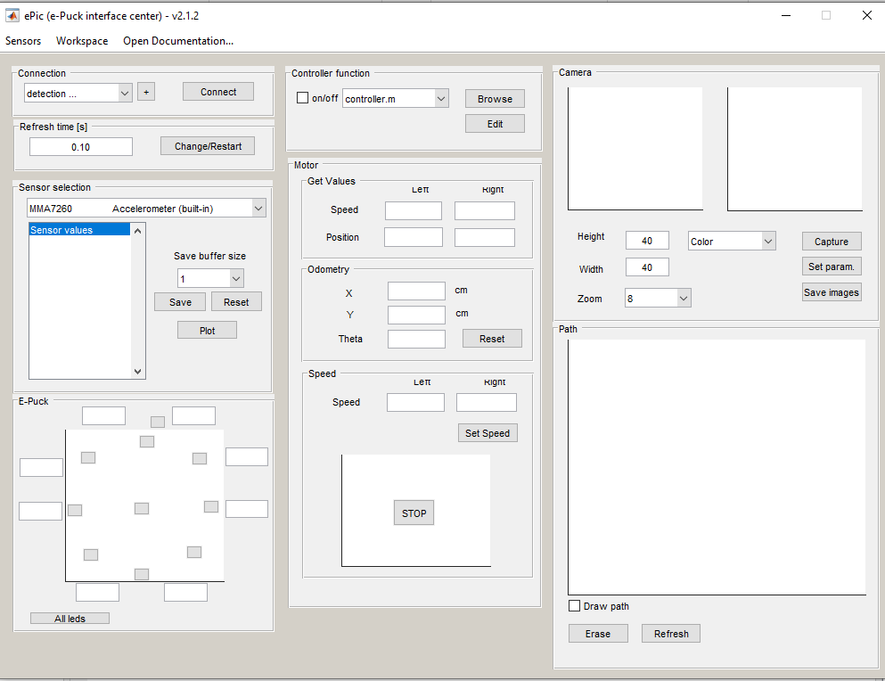

It requires the following, which are not part of this repository:

| Dependency | Description |
|---|---|
| `p_poly_dist.m` | Point-to-polygon distance function (MATLAB File Exchange). The equivalent algorithm is implemented inline in `my_controller.c`. |
| ePic toolbox | e-puck MATLAB interface providing the `ePic` object and its `get`/`set`/`activate`/`deactivate` methods. |
| `main.m` | Interface that owns the controller timer and sets `ControllerState`. |
| `x_p.mat`, `flag.mat` | Runtime state files holding the position window and the local-minimum flag. |

---

## Results

Parameters `k_a`, `k_r`, `k_w` and `k_v` were first calibrated so the robot avoids the
obstacle without entering a potential well:

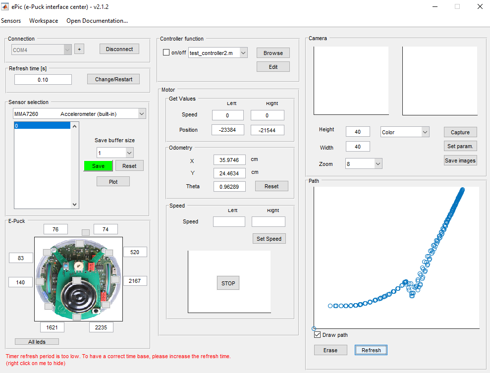

They were then recalibrated so the robot does enter one. The recorded positions cluster
in a limited region, which is the signal used for detection:

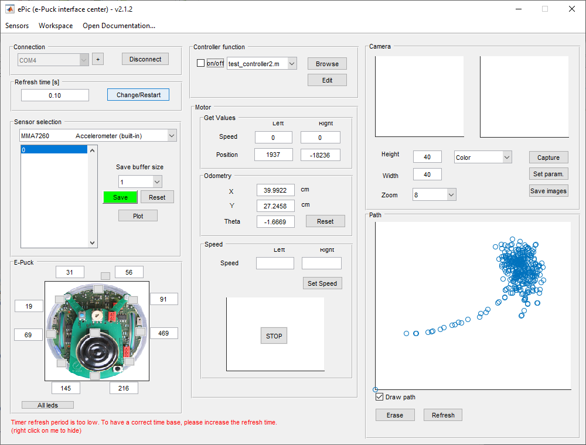

With the virtual-obstacle method enabled, the robot escapes the well and continues to the
goal:

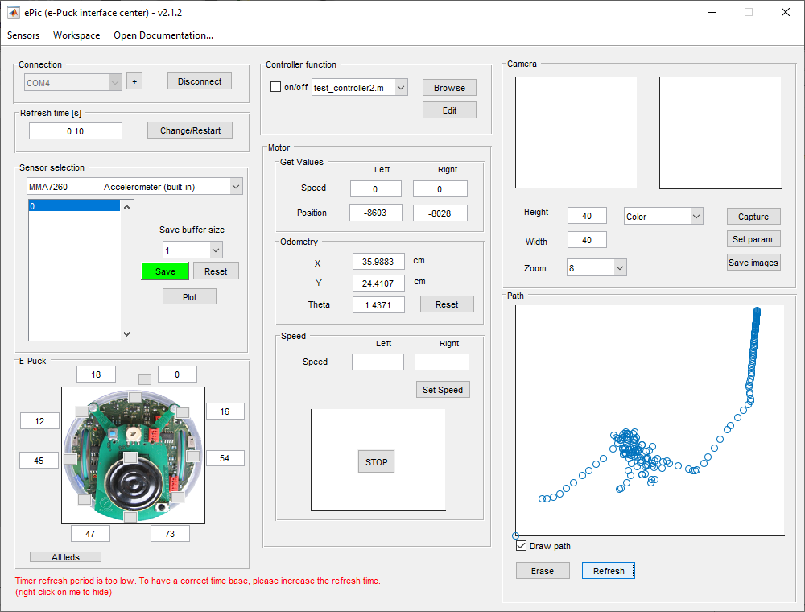

---

## Conclusions

The APF method was applied to an e-puck robot to travel from a start point to a goal past
a triangular obstacle, and extended with virtual obstacles to overcome the local-minimum
problem. The environment and robot were modelled in Webots to test the proposed
controller, and the final algorithm was run on the physical robot from MATLAB.

The method is simple to implement, has low computational cost, and allows new obstacles to
be added easily, which makes it suitable for real-time applications.

Limitations:

- The placement of the virtual obstacle affects the outcome. An unsuitable position can
  lead to another potential well, requiring further obstacles.
- The resulting path is not optimal.
- The map must be known in advance and static.

A proposed extension is to compute the repulsive forces from the robot's proximity
sensors rather than from stored obstacle geometry. This removes the requirement for a
prior map, allows moving obstacles, and reduces the cost of computing the distance to
every obstacle in the environment.

---

## References

1. Al-Bitar, S. *Mobile Robotics course notes*, HIAST, Damascus, 2022.
2. Lee, M. G. P. & M. C. *Artificial Potential Field based Path Planning for Mobile
   Robots*, Pusan, Korea, 2003.
3. Siegwart, R. & Nourbakhsh, I. R. *Introduction to Autonomous Mobile Robots*,
   MIT Press, 2004.
4. Astolfi, A. *Exponential Stabilization of a Mobile Robot*, Rome, 1995.

---

## License

Code: MIT, see [LICENSE](LICENSE). Figures and documentation: CC BY 4.0.

`webots/protos/Floor3.proto` is a Cyberbotics standard PROTO, Copyright Cyberbotics Ltd,
licensed for use only with Webots.
