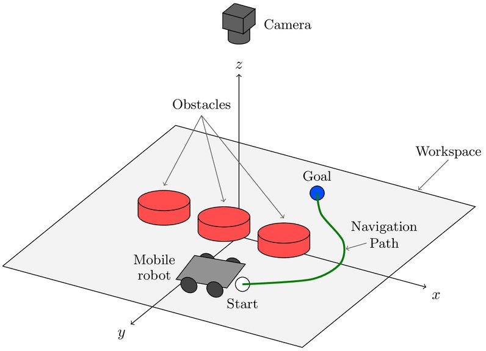

# Path Planning Algorithm

## 1. Navigation

Navigation is the ability of a robot to act on its knowledge and sensor readings to reach
a goal efficiently and reliably. It divides into two parts:

- **Path planning**: determining the route the robot will follow to a predefined goal,
  given a map of the environment. A strategic task concerning long-range decisions.
- **Obstacle avoidance**: modifying the robot's path to avoid obstacles using real-time
  sensor readings.

This project concerns path planning.



## 2. Path-planning strategies

### 2.1 Road map

The connectivity of the robot's environment is represented by a network of obstacle-free
routes. The network is expressed as a graph, and graph-search algorithms move from the
start node to the goal node. Two common constructions:

**Visibility graph**: each pair of obstacle vertices is connected provided they lie
within each other's field of view.


**Voronoi diagram**: the distance from the robot to the nearest obstacle is computed and
a connected network of routes is formed that maintains a safety margin between the robot
and the obstacles.


### 2.2 Cell decomposition

The space is divided into small connected regions called cells, distinguishing cells that
contain obstacles (occupied) from free cells.

**Exact cell decomposition**: each resulting cell is either occupied or free. The
complexity of the decomposition depends on the density and complexity of the obstacles.


**Approximate cell decomposition**: the map is divided using cells of fixed, small size.


### 2.3 Potential field

The robot is treated as a particle subject to different potential fields. The goal
generates an attractive potential field and obstacles generate a repulsive potential
field. Motion follows the resultant of these forces.


## 3. The potential field

**Attractive potential**, a quadratic well centred on the goal:

```
U_att(q) = ½ · k_att · ‖q − q_goal‖²
```

with `q = (x, y)` and `q_goal = (x_g, y_g)`, giving

```
F_att(q) = −k_att · (q − q_goal)
```

**Repulsive potential**, generated per obstacle:

```
U_rep(q) = ½ · k_rep · (1/ρ(q) − 1/ρ₀)²     if ρ(q) ≤ ρ₀
         = 0                                 otherwise
```

where `ρ(q)` is the shortest distance between the robot and the obstacle and `ρ₀` is the
influence radius. The corresponding force:

```
F_rep(q) = k_rep · (1/ρ(q) − 1/ρ₀) · (1/ρ²(q)) · (q − q_obst)/ρ(q)     if ρ(q) ≤ ρ₀
         = 0                                                            otherwise
```

`q_obst` is the point on the obstacle at the shortest distance from the robot's current
position.

**Resultant:**

```
F(q) = F_att(q) + F_rep(q)
```

## 4. The local-minimum problem

The method is subject to the problem of falling into a potential well: the resultant of
the forces acting on the robot at a given instant becomes approximately zero, and the
robot enters a state of oscillation about its current position without leaving the
region.

This occurs when the attractive and repulsive forces cancel at a point that is not the
goal, for example when the goal lies directly behind an obstacle and the robot
approaches along the line joining them.

### Detection

A robot in a potential well stops covering ground. A sliding window of the last 30
positions is maintained and its standard deviation computed:

```
σ = std(window)
```

A small `‖σ‖` reflects the clustering of the robot's positions in a limited region, and
therefore a potential well. Additional conditions prevent false detection: the robot must
not be near the goal and must not be near the start.

The Webots implementation adds the condition that the angle between the attractive and
repulsive forces exceeds 90°, which characterises the opposition of the two forces that
produces the well.

## 5. Virtual obstacles

Once a potential well is detected, a new obstacle is added in the vicinity of the well.
This obstacle generates a repulsive field which acts to move the robot out of the well.
The added repulsive force is:

```
F_ext(q) = (k_e/d_e) · (q − q_ext)                  if ‖q − q_ext‖ ≤ d_e
         = k_e · (q − q_ext)/‖q − q_ext‖            otherwise
```

where `q_ext` is the position of the added obstacle, taken as the centroid of the position
window.

At the equilibrium point where `F_att + F_rep = 0`, the total force is now `F_ext ≠ 0`
and the robot is displaced out of the well. The total force becomes:

```
F(q) = F_att(q) + F_rep(q) + Σᵢ F_ext,i(q)
```

The Webots implementation accumulates up to 50 virtual obstacles rather than replacing a
single one, so that a robot escaping one well into another retains the repulsion from the
first. The combined virtual force is scaled by

```
1 − exp(−d_goal² / σ)
```

which approaches zero at the goal, so that a virtual obstacle placed near the goal does
not prevent convergence.

## 6. Conversion to wheel speeds

The resultant force gives a desired direction of travel. For a differential-drive robot
this is resolved into a forward speed and a turn rate:

```
α   = atan2(F_y, F_x) − θ
v   = k_v · ‖F‖ · cos α
ω   = k_w · α
v_l = v + ω
v_r = v − ω
```

The `cos α` factor reduces the forward speed when the robot is not aligned with the force
direction, so the robot turns toward the required heading before advancing. For
`α > 90°`, `cos α < 0` and the forward speed reverses.

## 7. Properties

Advantages:

- Low computational cost, suitable for real-time operation.
- New obstacles are added by adding a term.
- Smooth paths without post-processing.

Limitations:

- The path is not optimal.
- Virtual-obstacle placement is a heuristic; an unsuitable position can lead to another
  potential well.
- Obstacle geometry must be known in advance and the map must be static.
